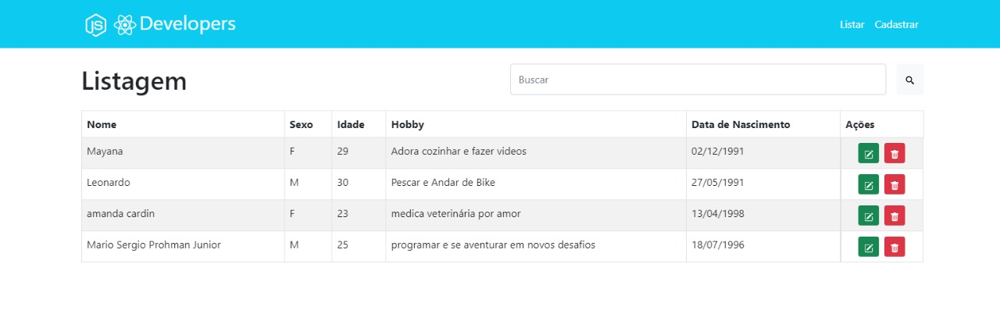
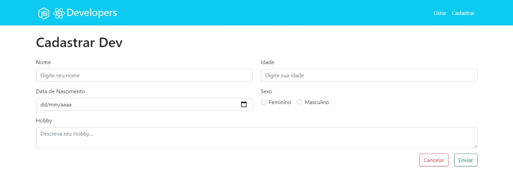
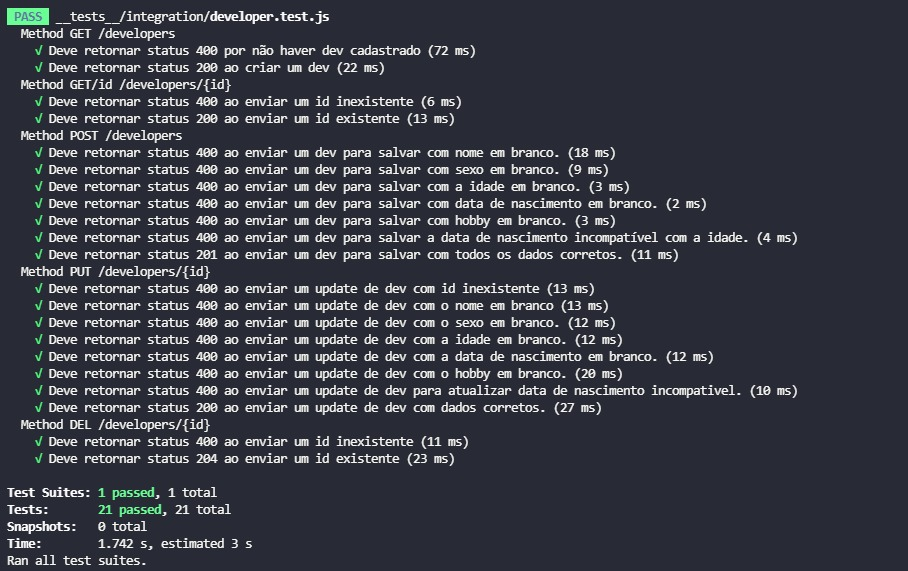
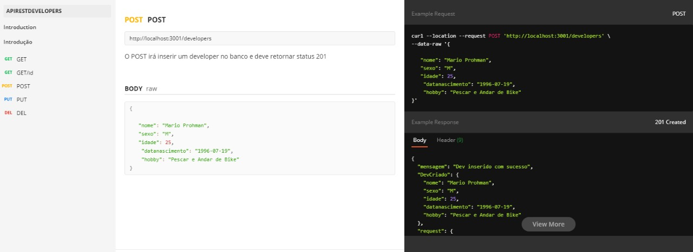

# Potential-crud

- Api-rest CRUD Developers 

## Para iniciar o projeto, subir o container e baixar as imagens no Docker:

```
    docker-compose up -d --build
```

## Rode o comando abaixo para acessar o container:

```
   docker container exec -it api_node_api_1 bash
```

## Quando acessar o container, execute o comando abaixo, para rodar as migrations:

```
    npx sequelize-cli db:migrate
```

# FrontEnd

- Demonstração de Interface

#### Depois de iniciar o projeto acesse: http://localhost:3000 para visualizar o frontend


   - página de Listagem





   - página de Cadastro




## Testes Unitários:
#### Para executar os testes acesse a pasta back e execute o comando abaixo:

```
    yarn test
```



## Documetação da API no Postman:

- [DocumentacaoPostman](https://documenter.getpostman.com/view/13685908/TzskD3NV)



## Redes Sociais:

- [Linkedin](https://www.linkedin.com/in/mario-prohman/)